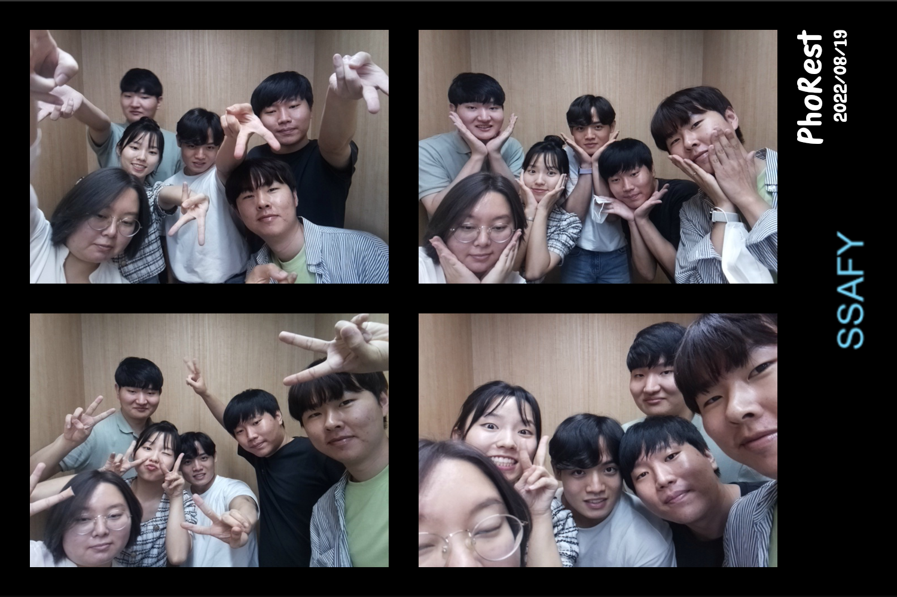
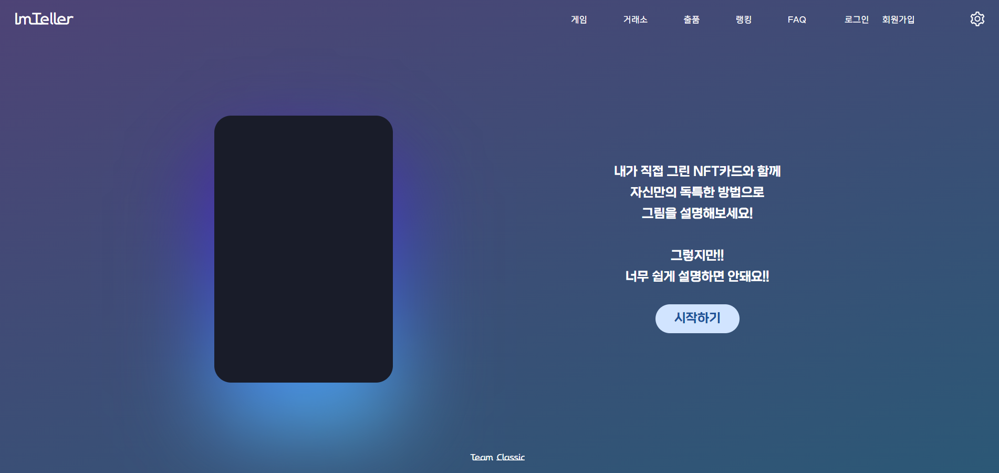

### Hi there 👋

궁금한 건 꼭 해보고 싶은 MoCCo의 github입니다.

### Tools

  

  

  

  

### Problem Solving

### What I Learned

- [algorithm](https://github.com/MoCCo329/TIL/tree/master/algorithm)
- [python](https://github.com/MoCCo329/TIL/tree/master/python)
- [java](https://github.com/MoCCo329/TIL/tree/master/java)
- [javascript](https://github.com/MoCCo329/TIL/tree/master/javascript)
- [html_css](https://github.com/MoCCo329/TIL/tree/master/html_css)
- [git](https://github.com/MoCCo329/TIL/tree/master/git)
- [vue](https://github.com/MoCCo329/TIL/tree/master/vue)
- [django](https://github.com/MoCCo329/TIL/tree/master/django)
- [db](https://github.com/MoCCo329/TIL/tree/master/db)
- [nft](https://github.com/MoCCo329/TIL/tree/master/nft)

### Projects

 

#### 1. PhoRest - 웹서비스가 추가된 인생네컷(사진부스) [링크](https://github.com/MoCCo329/PhoRest)

기간: 2022.07.05 ~ 2022.08.19 
인원: FE 2, BE 2, Embedded 2 
기술: React, GitLab, Jira(, Spring Boot, MySQL, PyQT, AWS, NginX, Jenkins) 
서비스 내용 

- 라즈베리파이를 활용해 직접 사진부스 제작

- 편리한 사진부스 이용(인원수에 맞는 추천 포즈를 보며 사진촬영, 원하는 프레임 적용)
- 사진 커뮤니티(사진공유 관리 및 다른사람 팔로우 등)
- 직접 프레임(사진 배경) 제작
- 일정 시간이 지나면 추억회상 카카오톡 알림

배운 내용 

- React를 통한 FE 구현
- Redux를 활용한 상태관리
- 카카오 로그인, JWT 등의 Auth

 

#### 2. ImTeller - NFT그림을 활용 할 수 있는 보드게임 서비스 [링크](https://github.com/MoCCo329/ImTeller)

기간: 2022.08.22 ~ 2022.10.07 
인원: FE 2, BE 2, SmartContract1 
기술: React, GitLab, Jira, Solidity, Truffle(, Spring Boot, MySQL, NginX, Jenkins, AWS, Docker) 
서비스 내용 

- 그림으로 진행하는 보드게임(DiXit + 다양한 아이템 사용) 구현
- 그림을 그릴 수 있는 그림판
- 그림을 출품하여 투표로 우수작 선정 및 무료 민팅(NFT화)
- 일정 토큰을 지불하여 본인의 그림 민팅 가능
- 거래소에서 NFT 거래 가능
- NFT 그림을 게임에서 사용시 고유 아이템을 사용 가능해 게임에 흥미를 더한다

배운 내용 

- WebSocket을 통한 실시간 게임 구현
- Ethereum Network, Web3

 

#### 3. HTWM(HomeTrainingWithMirror) - 거울과 화면을 동시에 보며 혼자서, 혹은 화상통화로 함께 운동하는 서비스 [링크](https://github.com/MoCCo329/HTWM)

기간: 2022.10.11 ~ 2022.11.25 
인원: Device FE 1, APP FE 2, BE 1, Embedded 1, MotionRecognition 1 
기술: React, Electron, GitLab, Jira, (ReactNative, Spring Boot, MySQL, NginX, Jenkins, AWS, Docker, OpenPose) 
서비스 내용 

- 스마트 미러 제작(라즈베리파이, 젯슨나노, 모니터, 카메라, 진동감지센서)
- 앱을 통해 원하는 운동루틴 관리, 운동기록 확인, 거울에서 찍은 사진 관리, 친구 화상 연결
- 친구가 화상통화를 수락하면 기기에서 자동으로 화상통화 연결진행
- 기기에서 본인이 만든 루틴 실행시 레퍼런스 자세 표시 및 포즈인식으로 기록 카운팅
- 노크 혹은 "안녕 트윗" 으로 음성인식을 시작하여 기기제어(루틴실행, 사진촬영 시작/종료) 가능

배운 내용 

- Electron과 React 를 활용하여 리눅스 프로그램 제작
- WebRTC 통신을 통한 화상통화
- Device, App, Server 등 여러 관계에서 API

